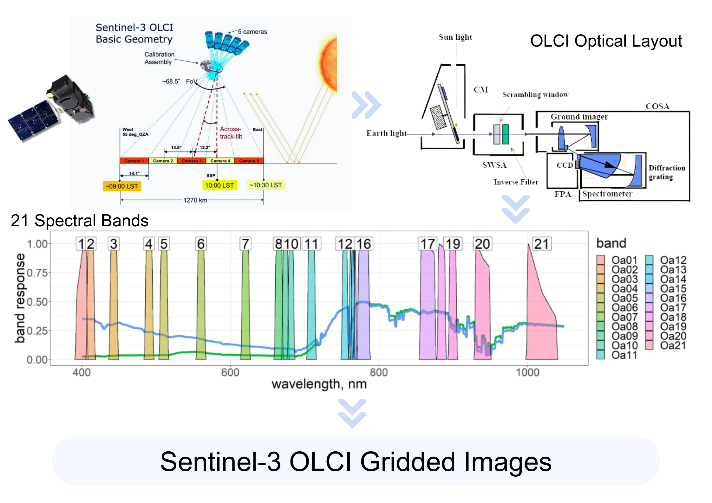
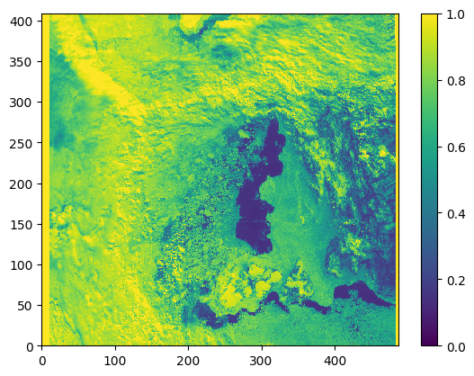
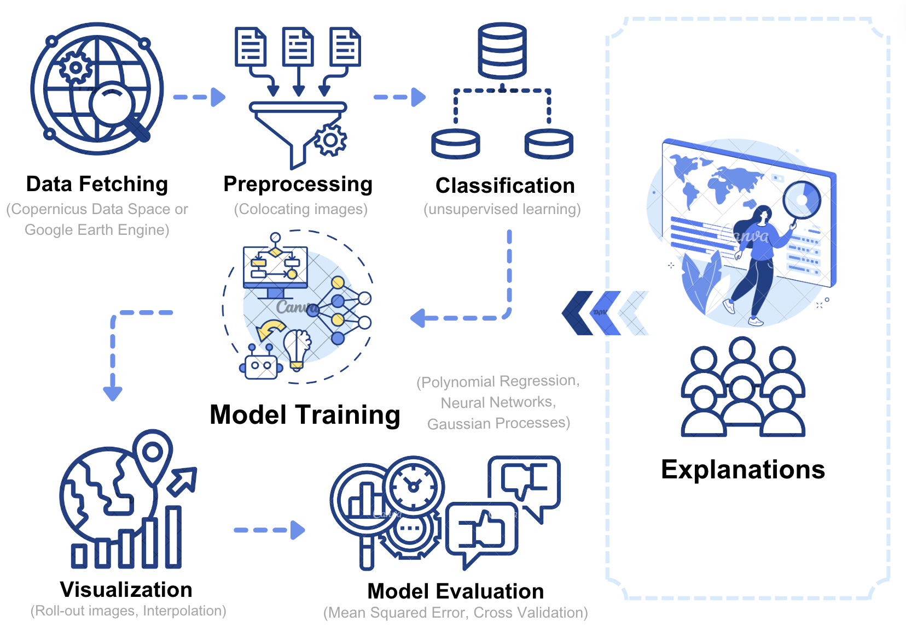

# Regression Analysis with satellite synergy

<!-- PROJECT DESCRIPTION-->

## Description of Problem
This programme aims to apply different regression techniques (i.e., Polynomial Regression, Neural Networks, and Gaussian Processes) on sea ice and lead or melt pond classification. The sea ice or melt pond fraction analysis is based on preprocessed colocated Sentinel-2 optical and Sentinel-3 OLCI images.

Melt pond fraction (MPF) is a significant factor affecting the sea ice heat and mass balance, especially during summer (H. Niehaus et al., 2023). It is studied extensively either by retrieving from Sentinel-2 optical data (H. Niehaus et al., 2023) or deriving from Sentinel-3 satellite data (H. Niehaus et al., 2024). Herein, we initialize the analysis by integrating Sentinel-2 and Sentinel-3 data, which hopefully can provide insight for a more accurate interpolation and prediction method on MPF.

Sentinel-3 is a satellite mission launched by the European Space Agency (ESA) in 2016 (Sentinel-3A) and 2018 (Sentinel-3B). It measures the Earth's oceans, land, ice and atmosphere with global coverage. For the ocean particularly, it measures the temperature, colour and height of the sea surface and the thickness of sea ice, which provides extensive information on the sea surface. [3] In this programme, we utilize the data captured by the Ocean and Land Color Instrument (OLCI) optical sensor for analysis.

The figure below (from GEOL0069 week 9 assignment) depicts the OLCI optical sensor layout and Sentinel-3 OLCI basic viewing geometry with the 21 spectral bands, which are used for capturing data across different regions of the electromagnetic spectrum. 5 fan-arranged Camera Optical Sub Assemblies (COSA) are used to detect the 1270km field of views. The assembly is tilted across-track to avoid sun-glint effects. The 21 bands range from 400 to 1020 nm with different spectral and radiometric characteristics. The calibrated products can be processed into gridded images for further usage. (Image adapted from Ref [4] and [5])



Launched by the European Space Agency (ESA) in 2015 (Sentinel-2A) and 2017 (Sentinel-2B), Sentinel-2 is a wide-swath, high-resolution, multi-spectral imaging mission. It carries an optical instrument that samples 13 spectral bands: four bands at 10 m, six bands at 20 m and three bands at 60 m spatial resolution. In the example analysis, we utilize the 10 m resolution data for analysis. [3] 

The cloud-free high-resolution Sentinel-2 image can complement the missing features from the Sentinel-3 image due to the large area of cloud coverage as shown below.




<!-- GETTING STARTED -->
## Getting Started

The project is built on the notebooks called _Colocating_S2_S3_images.ipynb_ and _Regression_analysis.ipynb_ linked to this GitHub. The _Colocating_S2_S3_images.ipynb_ notebook is used for importing and preprocessing the data. Once the data is prepared, _Regression_analysis.ipynb_ is feasible to run the analysis for different regression techniques.

### Fetching Data
The original raw data for Sentinel-2 and Sentinel-3 imagery is available at the Copernicus Open Access Hub of the European Space Agency (ESA) under: https://dataspace.copernicus.eu/. In this project, we use the 
  
### Installation

Use the package manager [pip](https://pip.pypa.io/en/stable/) to install essential packages.

For example,

```bash
pip install scikit-image
```

If Google Colab is used, mount Google Drive to Google Colab using:
  ```sh
  from google.colab import drive
  drive.mount('/content/drive')
  ```


## Usage

<!-- ```python
import foobar

# returns 'words'
foobar.pluralize('word')

# returns 'geese'
foobar.pluralize('goose')

# returns 'phenomenon'
foobar.singularize('phenomena')
```

 USAGE EXAMPLES -->

The first _Colocating_S2_S3_images.ipynb_ notebook is composed of step-by-step instructions for colocating Sentinel-2 and Sentinel-3 images, which includes importing and preprocessing data, defining desired region for analysis, labelling Sentinel-2 image pixels and finding colocated Sentinel-3 image pixels using KDTree.

This links to an illustration of KDTree 
https://opendsa-server.cs.vt.edu/ODSA/Books/Everything/html/_images/KDtree.png

The second notebook _Regression_analysis.ipynb_ implements the three different regression techniques after splitting data into training and testing sets. The predicted models are visualized on the Sentinel-3 OLCI images and the sample points are plotted to compare their performance. Finally, a referencing melt pond fraction product is visualized to compare with the predicted model.

In general, the whole model traning cycle is depicted by the diagram below. (Adapted from GEOL0069 week 9 assignment)




## Contributing

Pull requests are welcome. For major changes, please open an issue first to discuss what you would like to change.

Please make sure to update tests as appropriate.


## License

Distributed under the [MIT](https://choosealicense.com/licenses/mit/) License. 


## Contact

Rhoswen - rhoswen.zeng.20@ucl.ac.uk


## Reference
[1] Niehaus, H. et al. (2023) ‘Sea ice melt pond fraction derived from Sentinel‐2 Data: Along the Mosaic Drift and arctic‐wide’, Geophysical Research Letters, 50(5). doi:10.1029/2022gl102102. 

[2] Niehaus, H. et al. (2024) ‘Melt pond fractions on Arctic Summer Sea Ice retrieved from sentinel-3 satellite data with a constrained physical forward model’, The Cryosphere, 18(2), pp. 933–956. doi:10.5194/tc-18-933-2024. 

[3] SentiWiki Home. Available at: https://sentiwiki.copernicus.eu/web.

[4] Craig Donlon, ESA/ESTEC, Mission Science Division, B. Berruti, J. Frerick, C. Mavrocordatos, J. Nieke, H. Rebhan, J. Stroede and the S3 Team. (2008, November 19-20). Sentinel-3 OLCI and SLSTR. Medspiration UCM-6/GlobColour symposium. ESRIN, Frascati, Italy. https://www.globcolour.info/workshop_200811_presentations/3_Future/Donlon-Sentinel-3%20OLCI%20and%20SLSTR-v1.0.pdf.

[5] Prikaziuk, E.; van der Tol, C. Global Sensitivity Analysis of the SCOPE Model in Sentinel-3 Bands: Thermal Domain Focus. Remote Sens. 2019, 11, 2424. doi:10.3390/rs11202424.


